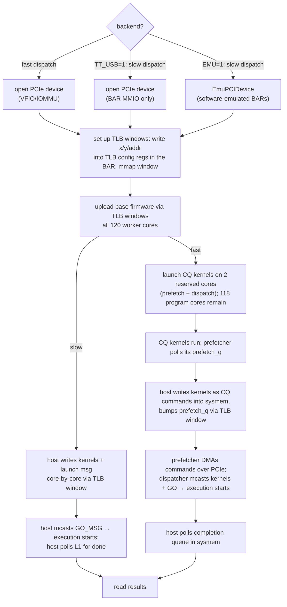

# abstractions 

## how a kernel reaches the hardware

slow dispatch is the host doing everything itself through MMIO TLB windows. fast dispatch still uploads base FW to every worker, then launches CQ kernels on two reserved tensix cores (prefetch + dispatch) fed by a host sysmem buffer DMA'd over PCIe — `TT_USB=1` skips VFIO/IOMMU entirely so only BAR MMIO is needed. `EMU=1` swaps in `EmuPCIDevice` (forcing `TT_USB=1`), so kernels run against an emulated device through the exact same slow dispatch path — everything from FW upload onward is identical.

## pcie / dram

## dsl.py 

## asm.py

## fw

## ttk/* 
