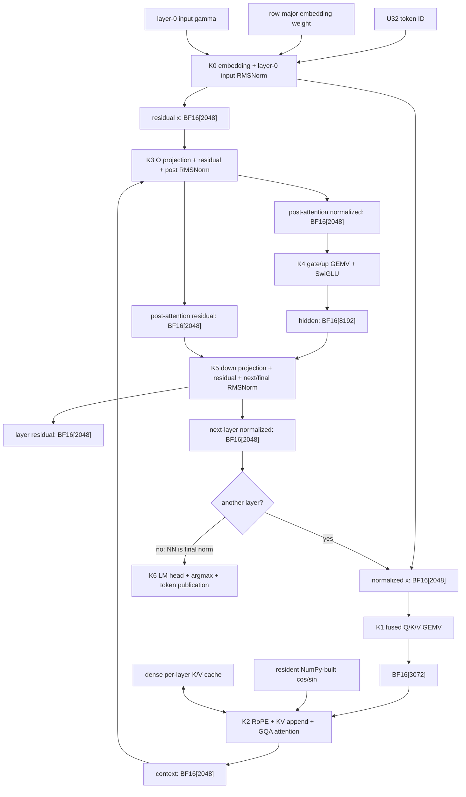

# Llama 3 decode: exact row-major kernel plan

This is the kernel-by-kernel rewrite plan for the Llama 3.2 1B decoder in
`examples/llama3.py`.

The fixed scope is:

- batch size 1;
- decode only;
- BF16 weights and persistent activations;
- FP32 reductions and online-softmax state;
- 16 layers, hidden size 2048, MLP size 8192;
- 32 query heads, 8 KV heads, head dimension 64;
- maximum context 8192;
- 117 compute cores where a projection uses the full device.

The target schedule is 82 launches per token:

```text
1 entry kernel
+ 16 layers * 5 kernels per layer
+ 1 LM-head/argmax kernel
= 82 launches
```

The implementation order is deliberately one fused kernel at a time. Kernels 0
through 2 have detailed engine pseudocode. Kernels 3 through 6 have exact
contracts and fusion protocols, but remain placeholder work until the first
three kernels are correct and measured.

## Non-negotiable storage rules

Every global, persistent, input, output, and inter-kernel buffer is:

```text
size        = product(logical_shape) * dtype.itemsize
byte order  = ordinary dense row-major
valid range = exactly [base, base + size)
```

There are no padded per-core rows, padded token vectors, hidden shrink views,
face-tiled buffers, tilized weights, tilize kernels, or untilize kernels.
Sharding assigns exact index ranges to cores; it does not change storage.

The allocator may reserve inaccessible alignment slack after a buffer. The
packer may flush an aligned word into private L1 scratch. FPU and SFPU issues
may contain inactive hardware lanes or reduction identities. None of those
locations are tensor elements, may be read as tensor data, or may be written
across a kernel boundary.

In particular:

```text
global row-major bytes
    -> exact NoC spans
    -> transient SrcA / SrcB / Dst organization
    -> exact NoC spans
    -> global row-major bytes
```

The transient Tensix organization is an execution fragment, not tilization.

All model weights retain their Hugging Face shapes and row-major order. A
projection consumes `weight[out_feature, in_feature]` directly. The first
version must not require a prepacked weight copy.

## Current-repository delta

The allocator and host path in the current tree already use exact dense storage.
`examples/row_major_mvmul.py` proves that row-major BF16 operands can feed
MVMUL and that Dst can be scattered to row-major output without a layout
conversion.

The Llama decoder still has old execution-layout assumptions that this rewrite
must remove:

- `q_compact`, `k_compact`, and `v_compact` use padded per-core slots;
- `gate`, `up`, `hidden`, and `logits` use padded per-core slots;
- `_bf16_tile_byte_offset`, `_compact_slot_byte_offset`, and
  `_global_tile_view` leak face/page addressing into inter-kernel layouts;
- `KV_CACHE_STORAGE_SHAPE` stores time/feature tiles instead of dense
  `[kv_head, token, feature]` rows;
- RoPE first reassembles heads and a second launch writes the KV cache;
- attention advances in 32-token physical cache blocks and pays setup,
  synchronization, query-copy, and online-update overhead for every block.

The new kernels should be added beside the old kernels and validated one at a
time. The old end-to-end path should not be partly converted.

## Bandwidth target and traffic floor

At BS=1, decode is primarily a weight-streaming problem. The unavoidable BF16
weight traffic is approximately:

| weights | bytes per layer | bytes per token |
|---|---:|---:|
| Q + K + V | 12,582,912 | 201,326,592 |
| O | 8,388,608 | 134,217,728 |
| gate + up + down | 100,663,296 | 1,610,612,736 |
| tied LM head | — | 525,336,576 |
| total, excluding tiny norm vectors | — | 2,471,493,632 |

At 448 GB/s this is about 5.52 ms/token or 181 tok/s. If the hardware number is
448 GiB/s, it is about 195 tok/s. Therefore 200 tok/s is a near-roofline target,
not a compute-only target.

The cache adds a context-dependent floor:

```text
K + V bytes per layer at context S = 2 * 8 * S * 64 * 2 = 2048 * S
K + V bytes across 16 layers       = 32768 * S
at S = 8192                        = 268,435,456 bytes/token
```

The achievable rate must therefore be reported by decode position. At the end
of the 8192-token window, weights plus cache are about 2.74 GB/token before
command, activation, and output traffic.

The performance rules for the rewrite are:

1. Read every projection weight exactly once per token.
2. Never write a weight-layout conversion.
3. Stage the input vector once per participating projection core.
4. Double-buffer weight reads against unpack/math.
5. Batch scalar projection outputs into exact contiguous NoC writes.
6. Read every historical K/V element exactly once and inject the current K/V
   directly from local state.
7. Make attention setup cost scale with `ceil(S / 128)`, not
   `ceil(S / 32)`.
8. Keep the resident trace; do not add host round trips between kernels.

## Exact buffer inventory

Shapes below omit the batch dimension because it is fixed at one.

| buffer | dtype and exact shape | bytes |
|---|---:|---:|
| active token ID | `U32[1]` | 4 |
| embedding / tied LM weight | `BF16[128256, 2048]` | 525,336,576 |
| norm weight | `BF16[2048]` | 4,096 |
| residual stream `x_a`, `x_b` | each `BF16[2048]` | 4,096 each |
| normalized token | `BF16[2048]` | 4,096 |
| QKV result | `BF16[3072]` | 6,144 |
| query slice | view `qkv[0:2048]`, `BF16[32,64]` | 4,096 |
| key slice | view `qkv[2048:2560]`, `BF16[8,64]` | 1,024 |
| value slice | view `qkv[2560:3072]`, `BF16[8,64]` | 1,024 |
| RoPE cosine table | `BF16[8192,64]` | 1,048,576 |
| RoPE sine table | `BF16[8192,64]` | 1,048,576 |
| per-layer key cache | `BF16[8,8192,64]` | 8,388,608 |
| per-layer value cache | `BF16[8,8192,64]` | 8,388,608 |
| attention context | `BF16[32,64]` / `BF16[2048]` | 4,096 |
| SwiGLU hidden | `BF16[8192]` | 16,384 |
| optional logits | `BF16[128256]` | 256,512 |

Gate and up have no global activation buffers in the 82-launch plan. Their
BF16-rounded scalars live only long enough for the fused SwiGLU operation.

The full-capacity cache is model state, not padding. `valid_tokens = position +
1` controls which prefix may be read. No kernel reads or clears the unused
suffix.

Projection sharding uses exact half-open row ranges:

```text
start(core, N, C) = floor(core * N / C)
end(core, N, C)   = floor((core + 1) * N / C)
count             = end - start
```

No output is represented as `[C, max_count]`. A core writes
`output[start:end]`.

## Initial sharding: all 117 cores, no cross-core GEMV reduction

The first implementation uses all 117 workers currently exposed by
`P100_WORKER_CORES` for every large projection. The active-core count must be a
build-time/program parameter rather than baked into buffer shapes, so later
scaling sweeps require only regenerating row descriptors and kernel images.

Projection work is sharded only along the output-feature axis. Every core owns
complete weight rows and performs the full K reduction locally:

```text
core c owns output rows [start(c,N,117), end(c,N,117))
for every owned row:
    read all K weights for that row
    reduce all K products on the same core
    write the final scalar directly to its exact global output index
```

This has no cross-core data dependency and no partial-sum exchange. Ragged
boundaries only change a core's loop count by one:

| projection domain | exact rows per core with 117 cores |
|---|---|
| fused QKV, `N=3072` | 30 cores × 27 rows, 87 cores × 26 rows |
| O/down, `N=2048` | 59 cores × 18 rows, 58 cores × 17 rows |
| gate or up, `N=8192` | 2 cores × 71 rows, 115 cores × 70 rows |
| LM head, `N=128256` | 24 cores × 1097 rows, 93 cores × 1096 rows |

Gate and up use the same 8192-row assignment so one core computes matching
gate/up row pairs. QKV uses one 3072-row descriptor domain; descriptors select
the appropriate existing Q, K, or V weight buffer and final QKV output offset.
A descriptor range crossing a Q/K or K/V boundary is split locally and does not
create communication.

The GEMV phase of every fused kernel keeps this independent output-row shard.
Only the RMSNorm and final-argmax phases perform small cross-core reductions:

| kernel | initial cores | reason |
|---|---:|---|
| embedding + RMSNorm | 1 | only 2048 values; avoid a global RMS reduction |
| fused QKV | 117 | exact independent output rows |
| RoPE + cache append + GQA | 8 | one core per KV head and its four Q heads |
| O + residual + post RMSNorm | 117 | output rows, then 117 FP32 RMS partials |
| gate/up + SwiGLU | 117 | matching row pairs remain on the same core |
| down + residual + next/final RMSNorm | 117 | output rows, then 117 FP32 RMS partials |
| LM head + argmax | 117 + one reducer | local argmax, then one final reduction |

The first version deliberately does not shard K. K sharding would reduce the
weight rows read by each core, but it would create a cross-core FP32 reduction
for every output and a synchronization point in every projection. That is a
different algorithm and is outside the no-communication baseline.

All 117 projection cores independently read the small activation vector from
DRAM. This duplicates activation traffic, but not weight traffic. For example,
QKV replicates a 4096-byte vector 117 times (479,232 bytes) while streaming
12,582,912 distinct weight bytes. The concurrency can still congest the NoC,
so core count is a performance parameter even though total weight bytes are
constant.

The later core-count cost model should be measured, not inferred from row
balance alone:

```text
time(kernel, C) =
    fixed_launch_and_setup(C)
  + max(
        max_core_rows(C) * compute_time_per_row,
        distinct_weight_bytes /
            effective_weight_bandwidth(kernel, C, placement, traffic_mix),
        replicated_activation_bytes(C) /
            effective_replica_bandwidth(kernel, C, placement, traffic_mix),
    )
  + cross_core_bytes(C) / cross_core_bandwidth
  + synchronization_cost(C)
```

The effective bandwidth terms are coupled by their shared NoC routes and must
come from counters/benchmarks; they are not independent advertised peaks.

For the output-row GEMV phase,
`cross_core_bytes = synchronization_cost = 0`. The two fused RMS phases add 117
FP32 partials and one scalar broadcast; the fused LM head adds 117
`(value,index)` partials. Sweep at least
`C in {32, 48, 64, 80, 96, 117}` later and retain the fastest value per kernel
and decode position. Start with 117 now so the row-major rewrite does not hide
the existing NoC scaling problem.

Transport optimization tiers, in order:

1. Bank-aware core placement, row assignment, request ordering, and staggered
   injection using ordinary independent DRAM reads.
2. Tune CB depth, read size, and outstanding transactions so 117 readers do not
   synchronize into a NoC burst.
3. Consider overlay streams for persistent routing/flow control if counters
   show injection or routing congestion rather than DRAM service saturation.
4. Consider DRISC/L1 fan-out only after measuring it. It adds a second NoC hop,
   loader-core work, program orchestration, and synchronization. It can avoid
   replicated activation reads, but distinct weight rows still have to cross
   the fabric exactly once.

The long-term target is to use every available worker—117 on the current
enumeration and 118 if a future topology exposes it—without aggregate
DRAM-to-worker traffic collapsing NoC throughput. Overlay or loader-core
schemes are not prerequisites for the first exact row-major kernels.

## Forward-pass graph



`K1` through `K5` execute once per layer. `K0` produces the first layer's
residual and normalized streams. On layers 0 through 14, K5 applies the next
layer's input RMSNorm; on layer 15 it applies final RMSNorm. K6 consumes that
final normalized vector.

The launch count is therefore:

| schedule component | launches |
|---|---:|
| K0 entry | 1 |
| K1–K5 across 16 layers | 80 |
| K6 LM head/argmax | 1 |
| total | **82** |

Eighty-two is the practical lower limit for this plan. Every boundary between
K1–K5 changes data ownership:

- 117 QKV producers feed 8 GQA consumers;
- 8 GQA consumers feed 117 O-projection workers;
- 117 post-RMS row owners feed every gate/up worker;
- 117 SwiGLU row owners feed every down-projection worker;
- 117 next-RMS row owners feed every next-layer QKV worker;
- every layer changes weight addresses.

Fusing across those boundaries without a global row-major handoff requires a
full-vector redistribution, overlay streams, or a persistent multi-stage
superkernel. Merely placing the existing write, barrier, and reread inside one
larger program would reduce the launch count without reducing the real work and
would make synchronization substantially more complex.

## Shared row-major engine routines

These are desired codegen helpers, not claims that the current `ttk` API
already implements them.

### Exact NoC spans

```text
read_exact(buffer, element_offset, element_count, l1_dst):
    assert element_offset + element_count <= product(buffer.shape)
    byte_offset = element_offset * buffer.dtype.itemsize
    byte_count  = element_count * buffer.dtype.itemsize
    for span in split_at_dram_stripes_and_16KiB(byte_offset, byte_count):
        noc_async_read(span.global_address, l1_dst, span.byte_count)
        l1_dst += span.byte_count

write_exact(l1_src, buffer, element_offset, element_count):
    assert element_offset + element_count <= product(buffer.shape)
    byte_offset = element_offset * buffer.dtype.itemsize
    byte_count  = element_count * buffer.dtype.itemsize
    for span in split_at_dram_stripes_and_16KiB(byte_offset, byte_count):
        noc_async_write(l1_src, span.global_address, span.byte_count)
        l1_src += span.byte_count
```

The final host/CQ or packer alignment word remains private scratch.
`write_exact` never rounds `byte_count`.

### UNPACK: row-major SFPU vector

```text
unpack_rm_vec32(l1_src, valid_lanes, dst_footprint):
    assert 1 <= valid_lanes <= 32
    configure row-major BF16 input and FP32 Dst destination
    move exactly valid_lanes values into the SFPU-visible 4x8 footprint
    disable SFPU lanes [valid_lanes, 32)
    do not fetch a value for an inactive lane
```

### UNPACK: row-major FPU elementwise block

```text
unpack_rm_elw_8x16(a_l1, b_l1, live_values=128):
    assert 1 <= live_values <= 128
    configure SrcA and SrcB for one 8x16 execution block
    map contiguous row-major a_l1 values to SrcA
    map contiguous row-major b_l1 values to SrcB
    for a reduction tail, inject zero only into non-live engine positions
    publish SrcA/SrcB valid
```

All model GEMV K dimensions are multiples of 128, so the projection kernels do
not need an ELW tail.

### UNPACK: row-major MVMUL panels

```text
unpack_rm_mvmul(B_rm, A_rm, live_m, live_n, live_k, transpose_A):
    # Hardware operation: SrcB[8,16] @ SrcA[16,16] -> Dst[8,16].
    assert 1 <= live_m <= 8
    assert 1 <= live_n <= 16
    assert 1 <= live_k <= 16
    load the live row-major B panel into SrcB
    load the live row-major A panel into SrcA
    if transpose_A:
        transpose only while loading SrcA
    disable unused result lanes where possible
    inject reduction identity zero into non-live K engine positions
    publish SrcA/SrcB valid
```

This is panel formation, not a layout conversion. `B_rm` and `A_rm` remain
row-major at every kernel boundary.

### FPU: 128-value dot block

```text
fpu_dot128(weight_rm, x_rm):
    unpack_rm_elw_8x16(weight_rm, x_rm)
    ELWMUL_HIFI2 -> FP32 Dst[8,16]
    return sfpu_reduce_sum128(Dst)
```

The BS=1 GEMV baseline intentionally uses ELWMUL plus a reduction. MVMUL would
produce 16 result columns for one input vector, so it either repeats the same
dot product or wastes 15 columns. It becomes attractive only if a later design
batches tokens, which is outside this document's fixed scope.

### SFPU: reductions and scalar functions

```text
sfpu_reduce_sum32(vec, valid_lanes):
    replace inactive lanes with 0
    reduce each physical 8-lane subgroup
    transpose/combine the four subgroup sums
    return FP32 scalar

sfpu_reduce_sum128(dst_block):
    load four 32-lane footprints from Dst[8,16]
    return sum(sfpu_reduce_sum32(footprint, 32) for footprint in footprints)

sfpu_rsqrt_positive(x):
    # Keep the current Blackhole-tested reciprocal-square-root sequence.
    estimate from exponent/magic constant
    apply the current polynomial refinement
    apply the final Newton step
    return FP32 result

sfpu_exp(x):
    return the current tested SFPU exponential approximation
```

### PACK: exact dense vector

```text
pack_rm_exact(dst, valid_elements, l1_scratch):
    configure packer to emit valid_elements in logical row-major order
    allow only the final private L1 flush word to be alignment-filled
    return valid_byte_count = valid_elements * output_dtype.itemsize

store_rm_exact(dst, output, output_offset, valid_elements):
    valid_bytes = pack_rm_exact(dst, valid_elements, private_l1)
    write_exact(private_l1, output, output_offset, valid_elements)
    assert bytes_written == valid_bytes
```

For scalar GEMV results, TRISC2 may pack into a private scalar slot while
NCRISC gathers only the valid BF16 halfword into a dense per-core staging
array. NCRISC then writes the whole exact contiguous output range. A 16-byte
packer flush must never become eight logical BF16 outputs.

### Five-stream scheduling template

```text
BRISC:
    fetch immutable/small operands
    double-buffer streamed input spans into CBs

TRISC0 / UNPACK:
    wait for input CB
    form transient SrcA/SrcB panels from row-major bytes
    publish source-valid state

TRISC1 / MATH:
    run FPU blocks
    run SFPU reductions/functions
    publish Dst ownership

TRISC2 / PACK:
    pack only live results into private row-major L1/CB staging

NCRISC:
    overlap completed exact writes with the next math iteration
    never write beyond the logical output range
```

Every producer/consumer relationship must be represented by CB credit,
semaphore, Src/Dst ownership, or an explicit stall. A generic barrier is not a
replacement for resource ownership.

## Kernel 0: fused embedding gather + layer-0 input RMSNorm

This replaces the current `decode_embedding` followed by `rmsnorm`.

Exact contract:

```text
input:
    token_id          U32[1]
    embedding_weight  BF16[128256,2048], row-major
    gamma             BF16[2048], row-major
output:
    residual_x        BF16[2048], row-major
    normalized_x      BF16[2048], row-major

x[i]          = embedding_weight[token_id[0], i]
inv_rms       = 1 / sqrt(sum_i(float(x[i]) ** 2) / 2048 + 1e-5)
normalized[i] = BF16_RNE(float(x[i]) * inv_rms * float(gamma[i]))
```

One core is sufficient. The kernel reads one 4 KiB embedding row and one 4 KiB
gamma vector. A cross-core RMS reduction would cost more synchronization than
it saves here.

### UNPACK / FPU / SFPU pseudocode

```text
embedding_rms_math(x_l1, gamma_l1):
    sumsq = FP32(0)

    for k in 0 .. 2048 step 128:
        unpack_rm_elw_8x16(x_l1[k:k+128], x_l1[k:k+128])
        squares = FPU.ELWMUL_HIFI2(SrcA, SrcB)
        sumsq += sfpu_reduce_sum128(squares)

    inv_rms = sfpu_rsqrt_positive(sumsq * (1.0 / 2048.0) + 1e-5)

    for k in 0 .. 2048 step 32:
        unpack x_l1[k:k+32] and gamma_l1[k:k+32] to SFPU-visible Dst
        xv = SFPU.load32(x)
        gv = SFPU.load32(gamma)
        yv = xv * gv
        yv = yv * broadcast(inv_rms)
        SFPU.store32(yv)
        pack_rm_exact(Dst, 32, normalized_l1 + 2*k)
```

### Five-stream pseudocode

```text
BRISC:
    token = read_exact(token_id, 0, 1)
    assert token < 128256
    read_exact(embedding_weight, token * 2048, 2048, x_l1)
    read_exact(gamma, 0, 2048, gamma_l1)

    # x_l1 already contains the exact row-major residual result.
    signal x_ready

TRISC0:
    for each 128-value square block:
        unpack_rm_elw_8x16(x_block, x_block)
    for each 32-value normalization block:
        unpack_rm_vec32(x_block)
        unpack_rm_vec32(gamma_block)

TRISC1:
    sumsq = 0
    for each square block:
        squares = FPU.ELWMUL_HIFI2()
        sumsq += sfpu_reduce_sum128(squares)
    inv_rms = sfpu_rsqrt_positive(sumsq / 2048 + 1e-5)
    for each normalization block:
        y = SFPU(x * gamma * inv_rms)
        publish 32 live results

TRISC2:
    pack all 2048 normalized values to dense normalized_l1

NCRISC:
    wait x_ready
    write_exact(x_l1, residual_x, 0, 2048)
    wait normalized_l1
    write_exact(normalized_l1, normalized_x, 0, 2048)
```

Acceptance checks:

- both outputs are exactly 4096 bytes;
- the next allocation remains unchanged;
- compare against NumPy BF16 input with FP32 RMS accumulation;
- compare the numerical path with the current tested RMSNorm;
- measure this fused kernel against the two current launches.

## Kernel 1: fused row-major Q/K/V GEMV

Yes, Q, K, and V should be one logical GEMV launch:

```text
Wqkv @ x = concat(Wq @ x, Wk @ x, Wv @ x)
```

It is one GEMV scheduling domain, not one MVMUL instruction and not necessarily
one physically concatenated weight allocation.

Exact contract:

```text
input:
    x   BF16[2048]
    Wq  BF16[2048,2048], row-major
    Wk  BF16[512,2048],  row-major
    Wv  BF16[512,2048],  row-major
output:
    qkv BF16[3072], row-major

qkv[0:2048]       = Wq @ x
qkv[2048:2560]    = Wk @ x
qkv[2560:3072]    = Wv @ x
```

The first version keeps the three existing weight buffers. Each core receives
an exact list of `(matrix, source_row, qkv_output_index)` descriptors. This
preserves row-major safetensor uploads and allows balanced aggregate work
without creating a weight-concatenation kernel.

Each core stages the 4096-byte input vector once. Weight traffic is double
buffered in 128-value, 256-byte chunks. Since 2048 is divisible by 128, every
weight read and FPU issue is fully live.

### UNPACK / FPU / SFPU / PACK pseudocode

```text
gemv_row(weight_row_l1, x_l1):
    accumulator = FP32(0)

    for k in 0 .. 2048 step 128:
        # BRISC fetch of block k+128 overlaps this block.
        unpack_rm_elw_8x16(weight_row_l1[k:k+128], x_l1[k:k+128])
        products = FPU.ELWMUL_HIFI2(SrcA, SrcB)
        accumulator += sfpu_reduce_sum128(products)

    return BF16_RNE(accumulator)

pack_core_qkv_results(results, descriptors):
    # Results are dense in local work order, not padded to a core maximum.
    for each maximal consecutive qkv output range:
        pack exactly range.length scalars into dense_l1
        write_exact(dense_l1, qkv, range.start, range.length)
```

The math path should retain the scalar accumulator in an SFPU LReg across the
16 K blocks. Dst is recycled after each 128-value reduction. Do not materialize
2048 products or a 1024-element output page.

### Five-stream pseudocode

```text
BRISC:
    read_exact(x, 0, 2048, x_l1)

    for descriptor in this_core_rows:
        for k in 0 .. 2048 step 128:
            wait for free weight_ping_or_pong
            read_exact(
                descriptor.weight,
                descriptor.source_row * 2048 + k,
                128,
                weight_ping_or_pong,
            )
            push weight block

TRISC0:
    for descriptor in this_core_rows:
        for k in 0 .. 2048 step 128:
            wait weight block
            unpack_rm_elw_8x16(weight_block, x_l1[k:k+128])
            release weight block

TRISC1:
    for descriptor in this_core_rows:
        acc = FP32(0)
        for k in 0 .. 2048 step 128:
            products = FPU.ELWMUL_HIFI2()
            acc += sfpu_reduce_sum128(products)
        publish BF16_RNE(acc) with descriptor.output_index

TRISC2:
    pack each scalar into the exact local dense result list
    publish completed consecutive ranges

NCRISC:
    for completed range:
        write_exact(range.l1, qkv, range.output_start, range.count)
```

Performance requirements:

- total weight reads are exactly 12,582,912 bytes per layer;
- each core reads `x` once, not once per Q/K/V matrix or output row;
- BRISC weight reads overlap TRISC0/TRISC1 on the other buffer;
- output traffic is exactly 6144 bytes;
- no zeroing of `[117,max_rows]` scratch or output;
- profile QKV achieved DRAM bandwidth separately from end-to-end decode.

Possible later optimization: compute two or more output rows in a pipelined
Dst schedule so unpack and SFPU reduction latency is hidden. Do not switch BS=1
GEMV to MVMUL until measurement beats ELWMUL plus reduction.

## Kernel 2: fused RoPE + K/V cache append + grouped-query attention

This replaces `decode_rope`, `kv_cache_write`, and `gqa_attention_fused` with
one eight-core launch. It removes `q_heads`, `k_heads`, and `v_heads`
inter-kernel buffers and never writes rotated Q to global memory.

The NumPy `rope_table()` remains the source of the resident cosine and sine
tables. They are uploaded once as exact row-major `BF16[8192,64]`.

Exact contract:

```text
input:
    qkv          BF16[3072]
    cos          BF16[8192,64]
    sin          BF16[8192,64]
    position     U32 scalar launch constant
output/state:
    key_cache    BF16[8,8192,64]
    value_cache  BF16[8,8192,64]
output:
    context      BF16[32,64]

q = view qkv[0:2048]       as [32,64]
k = view qkv[2048:2560]    as [8,64]
v = view qkv[2560:3072]    as [8,64]

rotate_half(x)[0:32]  = -x[32:64]
rotate_half(x)[32:64] =  x[0:32]
rope(x) = x * cos[position] + rotate_half(x) * sin[position]

key_cache[:,position,:]    = rope(k)
value_cache[:,position,:]  = v

for kv_head h:
    Qh = rope(q[4*h : 4*h+4, :])
    Kh = concat(key_cache[h, 0:position, :], rope(k[h])[None, :])
    Vh = concat(value_cache[h, 0:position, :], v[h][None, :])
    P  = softmax(Qh @ Kh.T / sqrt(64), axis=-1)
    context[4*h : 4*h+4, :] = P @ Vh
```

Core `h` owns KV head `h` and query heads `[4*h, 4*h+4)`. It reads those four Q
rows plus one K/V row, applies all five RoPE operations locally, appends K/V,
and immediately runs attention. The just-produced K/V row is injected directly
into the final attention block, so attention does not write then reread the
current token. The exact cache writes complete before kernel completion and
make the row persistent for the next token.

### RoPE phase: UNPACK / SFPU pseudocode

```text
rope64(x_l1, cos_l1, sin_l1):
    # Two exact 32-lane groups; no 1024-element operand pages.
    x_lo = SFPU.load32(x_l1[0:32])
    x_hi = SFPU.load32(x_l1[32:64])
    c_lo = SFPU.load32(cos_l1[0:32])
    c_hi = SFPU.load32(cos_l1[32:64])
    s_lo = SFPU.load32(sin_l1[0:32])
    s_hi = SFPU.load32(sin_l1[32:64])

    y_lo = x_lo * c_lo + (-x_hi) * s_lo
    y_hi = x_hi * c_hi + x_lo * s_hi

    store BF16_RNE(y_lo), BF16_RNE(y_hi)
    return y[64]
```

FPU is not needed. RoPE is two vector multiply-adds with a split-half exchange,
which maps directly to SFPU LRegs.

### RoPE/cache phase: five-stream pseudocode

```text
BRISC, core h:
    read_exact(cos, position * 64, 64, cos_l1)
    read_exact(sin, position * 64, 64, sin_l1)
    read_exact(qkv, h * 4 * 64, 4 * 64, q_group_l1)
    read_exact(qkv, 2048 + h * 64, 64, k_l1)
    read_exact(qkv, 2560 + h * 64, 64, v_l1)

TRISC0:
    unpack the five head vectors and shared cos/sin row for rope64

TRISC1:
    for query row in 0 .. 4:
        Q_local[row,:] = rope64(q_group_l1[row,:], cos_l1, sin_l1)
    K_local = rope64(k_l1, cos_l1, sin_l1)

TRISC2:
    pack exactly 4*64 Q_local values to private query_l1
    pack exactly 64 K_local values to private key_append_l1

NCRISC, core h:
    cache_offset = (h * 8192 + position) * 64
    write_exact(key_append_l1, key_cache, cache_offset, 64)
    write_exact(v_l1,       value_cache, cache_offset, 64)
```

No core reads a cache tile before modifying one row. No cache row contains
tokens from another logical axis. There is no zero initialization requirement
for the unread suffix.

### Attention phase

Exact contract for `S = position + 1`:

```text
for kv_head h:
    Qh = Q_local                              # [4,64]
    Kh = key_cache[h, 0:S, :]                # [S,64], current K is local
    Vh = value_cache[h, 0:S, :]              # [S,64], current V is local
    P  = softmax(Qh @ Kh.T / sqrt(64), axis=-1)
    context[4*h : 4*h+4, :] = P @ Vh
```

The eight cores remain independent through the attention phase. Each writes
one exact contiguous 512-byte context span.

The stream block is 128 real tokens, not a cache-storage tile:

```text
ATTN_BLOCK_TOKENS = 128
one K block per KV head = 128 * 64 * 2 = 16 KiB
one V block per KV head = 128 * 64 * 2 = 16 KiB
```

This makes each logical K or V request no larger than the maximum length-based
NoC packet and reduces loop/setup/online-update count by 4x relative to the
current 32-token loop. `read_exact` still splits the request at DRAM stripes.
The final block uses `T = min(128, S - block_start)` and reads exactly `T * 64`
K values and the same number of V values.

Use the stable online-softmax recurrence for each of four query rows:

```text
m = -infinity
l = 0
O = zeros([4,64])

for each live cache block:
    scores = Q @ K_block.T * (1 / sqrt(64))
    block_m = row_max(scores over T live columns)
    new_m = max(m, block_m)
    alpha = exp(m - new_m)
    P = exp(scores - new_m)
    l = l * alpha + row_sum(P)
    O = O * alpha + P @ V_block
    m = new_m

context = O / l
```

`m`, `l`, and `O` stay FP32 in Dst for the entire kernel. `P` is a private
row-major BF16 handoff from SFPU/pack to the PV MVMUL. It is never a global
buffer.

### UNPACK / FPU / SFPU / PACK pseudocode

```text
attention_score_block(Q[4,64], K[T,64]):
    for n in 0 .. T step 16:
        live_n = min(16, T - n)
        score_panel[0:4, n:n+live_n] = 0

        for k in 0 .. 64 step 16:
            unpack_rm_mvmul(
                B_rm=Q[0:4, k:k+16],
                A_rm=K[n:n+live_n, k:k+16],
                live_m=4,
                live_n=live_n,
                live_k=16,
                transpose_A=true,
            )
            FPU.MVMUL_HIFI2(accumulate=(k != 0))

    SFPU multiply all live scores by 1/sqrt(64)
    return only score[0:4,0:T]

online_update(scores[4,T], m[4], l[4], O[4,64]):
    block_m = SFPU.row_max(scores, live_columns=T)
    new_m   = max(m, block_m)
    alpha   = sfpu_exp(m - new_m)
    P       = sfpu_exp(scores - new_m)
    l       = l * alpha + SFPU.row_sum(P, live_columns=T)
    O       = O * alpha
    m       = new_m
    return P

attention_value_block(P[4,T], V[T,64], O[4,64]):
    # Pack P once. Re-read/retain that private row-major block for all four
    # 16-feature output panels; do not pack duplicate P copies.
    pack_rm_exact(P, 4*T, probability_l1)

    for n in 0 .. 64 step 16:
        for k in 0 .. T step 16:
            live_k = min(16, T - k)
            unpack_rm_mvmul(
                B_rm=P[0:4, k:k+live_k],
                A_rm=V[k:k+live_k, n:n+16],
                live_m=4,
                live_n=16,
                live_k=live_k,
                transpose_A=false,
            )
            FPU.MVMUL_HIFI2(
                dst=O[:,n:n+16],
                accumulate=true,
            )
```

The physical MVMUL has eight output rows. Only four are live query rows. Rows
4 through 7 are inactive execution rows and never become buffer elements. For
the final N or K panel, invalid engine positions receive the reduction identity
without issuing a global read.

There is no global mask tensor, zero tensor, probability tensor, padded final
cache block, or full-cache clear.

### Five-stream pseudocode

```text
BRISC:
    h = kv_head_for_this_core
    S = position + 1
    Q = query_l1

    for block_start in 0 .. S step 128:
        T = min(128, S - block_start)
        cached_T = min(T, max(0, position - block_start))
        wait for free K/V ping-or-pong buffers
        cache_offset = (h * 8192 + block_start) * 64
        read_exact(key_cache,   cache_offset, cached_T * 64, key_block)
        read_exact(value_cache, cache_offset, cached_T * 64, value_block)
        if cached_T < T:
            append key_append_l1 and v_l1 as the final row of this block
        push (key_block, value_block, T)

TRISC0:
    keep query_l1 resident for the whole kernel
    for each block:
        form Q/K MVMUL panels directly from row-major L1
        after P is published, form P/V MVMUL panels
        retain or re-unpack the single P block for four V feature panels

TRISC1:
    m[4] = -infinity
    l[4] = 0
    O[4,64] = 0

    for each block:
        scores = attention_score_block(Q, K)
        P = online_update(scores, m, l, O)
        publish P for pack
        attention_value_block(P, V, O)

    for row in 0 .. 4:
        O[row,:] *= reciprocal(l[row])
    publish exact 4x64 context

TRISC2:
    for each block:
        pack one exact 4*T probability block to private probability_l1
        signal probability ready
    pack exact 4*64 final context values to context_l1

NCRISC:
    write_exact(context_l1, context, h * 4 * 64, 4 * 64)
```

The actual stream split may require TRISC2 to publish a probability CB that
TRISC0 consumes on the next phase. The graph must explicitly encode:

```text
score MVMUL
  -> SFPU online update
  -> probability pack complete
  -> probability unpack with matching V block
  -> PV MVMUL
  -> probability scratch reuse
```

Performance checks must record positions
`1, 32, 128, 512, 1024, 2048, 4096, 8192` and report:

- total K bytes read;
- total V bytes read;
- number of 128-token blocks;
- NoC busy time;
- MVMUL issue time;
- SFPU/pack/unpack time;
- whole-kernel time;
- end-to-end tokens/s at the same positions.

Historical cache reads are exactly `2048 * (S - 1)` bytes per layer and the
current-token cache append is exactly 2048 bytes, for `2048 * S` total cache
traffic. Any larger value is avoidable traffic.

Acceptance checks:

- compare all 40 rotated heads internally with `rope_table()` and NumPy
  split-half RoPE;
- verify Q is never written as a rotated global intermediate;
- verify only cache token `position` changes for every KV head;
- compare context with a full NumPy GQA reference;
- test positions 0, 15, 16, 31, 32, 127, 128, 8191;
- byte-check the next allocation after QKV, context, and each cache;
- measure against the three current RoPE, cache-write, and attention launches.

## Kernel 3: fused output projection + residual + post-attention RMSNorm

Placeholder after Kernel 2 is correct and measured.

Exact contract:

```text
input:
    context       BF16[2048]
    Wo            BF16[2048,2048], row-major
    residual_x    BF16[2048]
    post_gamma    BF16[2048]
output:
    x_attn         BF16[2048]
    x_postnorm     BF16[2048]

x_attn = BF16_RNE(Wo @ context + residual_x)
x_postnorm = rmsnorm(x_attn, post_gamma)
```

Use the Kernel 1 row-major GEMV pipe. Every core:

1. Computes its exact 17 or 18 output rows.
2. Adds the matching residual and rounds each `x_attn` value to BF16.
3. Keeps those few BF16 values in private L1, writes its exact `x_attn` range,
   and accumulates one FP32 sum-of-squares partial from the BF16 values.
4. Sends one FP32 partial to a designated reducer core.
5. Waits for the reducer to sum 117 partials, compute reciprocal RMS, and
   multicast one FP32 scale.
6. Reads only its exact `post_gamma` range, normalizes the retained values, and
   writes its exact `x_postnorm` range.

The cross-core payload is 468 bytes of partials plus one scalar multicast. The
BF16 rounding before the sum of squares preserves the original kernel-boundary
semantics. There is no compact projection buffer, reassembly kernel, or
standalone RMSNorm launch.

## Kernel 4: fused gate/up row-major GEMV + SwiGLU

Placeholder using one staged input and two row-major weight streams.

Exact contract:

```text
input:
    x_postnorm  BF16[2048]
    Wgate       BF16[8192,2048], row-major
    Wup         BF16[8192,2048], row-major
output:
    hidden      BF16[8192]

gate_i   = BF16_RNE(Wgate[i,:] @ x_postnorm)
up_i     = BF16_RNE(Wup[i,:] @ x_postnorm)
hidden_i = BF16_RNE(silu(float(gate_i)) * float(up_i))
```

Each core owns matching gate/up rows, computes both FP32 dots, applies the
explicit BF16 boundary rounding, and runs scalar/vector SFPU SwiGLU before
discarding gate and up. It reads exactly 67,108,864 weight bytes and writes one
exact 16,384-byte hidden vector. Gate/up are never global buffers, there is no
`[117,71]` output, and no compact-to-dense kernel follows.

## Kernel 5: fused down projection + residual + next/final RMSNorm

Placeholder using the Kernel 1 GEMV pipe with K=8192.

Exact contract:

```text
input:
    hidden      BF16[8192]
    Wdown       BF16[2048,8192], row-major
    x_attn      BF16[2048]
    norm_gamma  BF16[2048]  # next layer input gamma, or final gamma
output:
    layer_x     BF16[2048]
    next_norm   BF16[2048]

layer_x = BF16_RNE(Wdown @ hidden + x_attn)
next_norm = rmsnorm(layer_x, norm_gamma)
```

The K loop has 64 fully live 128-value ELWMUL/reduction blocks. The weight
matrix is read exactly once, residual add is fused before output rounding, and
the result is the next layer's exact residual stream.

The fused RMS phase uses the same 117-partial protocol as Kernel 3. On layers 0
through 14, `norm_gamma` is the next layer's input RMS weight and `next_norm`
feeds the next Kernel 1. On layer 15, `norm_gamma` is the final RMS weight and
`next_norm` feeds Kernel 6. This removes all 15 standalone next-layer input
RMSNorm launches and the standalone final RMSNorm launch.

## Kernel 6: fused row-major LM-head GEMV + argmax + token publication

Placeholder using the tied embedding allocation as a row-major
`BF16[128256,2048]` matrix.

Exact greedy-decode contract:

```text
input:
    final_x       BF16[2048]
    tied_weight   BF16[128256,2048], row-major
state/output:
    next_token      U32[1]
    token_history   U32[8192] only if retained by the runtime API
optional output:
    logits          BF16[128256]
```

Every core owns its exact 1096 or 1097 vocabulary rows. It computes each dot,
rounds the logit to BF16, updates a local `(value,index)` argmax, and writes no
logit in normal greedy mode. One reducer compares the 117 partials, applies the
defined tie break, publishes one U32, and optionally writes
`token_history[position + 1]`.

Validation mode writes the exact `BF16[128256]` logits buffer while performing
the same local reduction. It is not `[117,max_vocab_rows_per_core]` and does not
add a second launch.

## Kernel-by-kernel bring-up order

1. Implement and test `read_exact`, `write_exact`, row-major vector unpack, and
   exact pack tails without running Llama.
2. Implement Kernel 0; compare both exact outputs and adjacent-buffer canaries.
3. Implement Kernel 1 with Q descriptors, then add K/V descriptors without
   changing the launch boundary.
4. Implement Kernel 2's local RoPE/cache phase, then its attention phase at
   `S <= 128`, then multiple blocks and all tail sizes `1..127`.
5. Implement Kernel 3's projection/residual phase, then add the 117-partial
   RMS reduction and exact normalized output in the same kernel.
6. Implement Kernel 4 with paired gate/up dots and apply SwiGLU before either
   scalar can become a global buffer.
7. Implement Kernel 5's down/residual phase, then reuse Kernel 3's fused RMS
   protocol with next-layer and final gamma selection.
8. Implement Kernel 6 in exact-logits validation mode while also reducing local
   argmax values, then disable logits writes for normal greedy decode.
9. Build the resident trace, assert exactly 82 launches, and switch end-to-end
   decode only after every old compact/tiled intermediate has disappeared.

For every kernel, correctness precedes optimization, but the first correct
version must already obey exact row-major storage. A temporary tilized or padded
inter-kernel buffer is not an allowed bring-up shortcut.

## End-to-end success criteria

Correctness:

- identical greedy tokens to the NumPy/tinygrad reference over a long decode;
- per-kernel BF16/FP32 tolerances documented and tested;
- no write changes an adjacent allocation;
- no read touches an invalid cache suffix;
- no persistent buffer has a padded shape or face-order byte stream;
- safetensor weights are uploaded without permutation.

Performance:

- report tokens/s by decode position, not one unexplained average;
- report effective weight bandwidth for QKV, O, gate/up, down, and LM head;
- report attention cache bytes and time separately;
- sustain one read of each required weight and cache element;
- approach the weight/cache bandwidth roofline, with 200 tok/s treated as the
  short-context stretch target and the context-adjusted roofline used later in
  the window.
